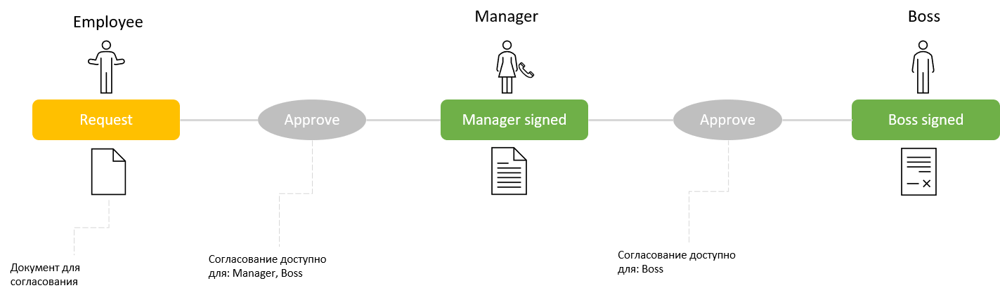

# ApprovalPlugin

[Плагин](/documentation/plugins/), который реализует функции для работы с [Approval history](#Approval-history) вашего документа и [Inbox](#Inbox)/[Outbox](#Outbox) 

## Сontent
1. [Terms](#Terms)
    1. [Approval history](#Approval-history)
        1. [Как заполняется](#Approval-history-как-заполняется)
        2. [Структура](#Approval-history-структура)
        3. [Как получить](#Approval-history-как-получить)
    2. [Inbox](#Inbox)
        1. [Как заполняется](#Inbox-как-заполняется)
        2. [Структура](#Inbox-структура)
        3. [как получить](#Inbox-как-получить)
    3. [Outbox](#Outbox)
        1. [Как заполняется](#Outbox-как-заполняется)
        2. [Структура](#Outbox-структура)
        3. [Как получить](#Outbox-как-получить)
2. [How it work](#How-it-work)
3. [Installation and setting](#Installation-and-setting)
4. [Cases](#Cases)
    1. [Как Получить список пользователей, которым доступно согласование документа](#Получить-список-пользователей-которым-доступно-согласование-документа)
    2. [Как Получить список документов которые пользователь может согласовать](#Получить-список-документов-которые-пользователь-может-согласовать)
    3. [Как Получить историю согласований документа](#Получить-историю-согласований-документа)
    4. [Как Получить список документов согласованных пользователем](#Получить-список-документов-согласованных-пользователем)

## Terms

### Approval history

[Table of contents](#Сontent)

Представляет из себя список выполненных и возможных согласований документа

#### **Approval history: как заполняется**
1. В режиме [Pre-execution](/documentation/execution/pre-execution/) для каждого [activity](/documentation/scheme/activities/) создается запись без заполнения конкретного пользователя (IdentityId, TransitionTime, Commentary, TriggerName)
2. При выполнении в режиме [Execution](/documentation/execution/) происходит обновление записи с заполнение информации о переходе и пользователе (IdentityId, TransitionTime, Commentary, TriggerName).

Хранится в таблице **WorkflowApprovalHistory**.

#### **Approval history: структура**

```C#
public class ApprovalHistoryItem
{
    public Guid Id { get; set; } //Id записи
    public Guid ProcessId { get; set; } //Id документа согласование которого небходимо
    public string IdentityId { get; set; } //Id пользователя согласовавшего документ на данном этапе
    public List<string> AllowedTo { get; set; } //Список пользователей которым доступно согласование документ на данном этапе
    public DateTime? TransitionTime { get; set; } //Время согласования документа
    public long Sort { get; set; } //Порядковый номер этапа согласования
    public string InitialState { get; set; } //Состояние предшествущее согласованию
    public string DestinationState { get; set; } //Состояние документа после согласования
    public string TriggerName { get; set; } //Название выполненного согласования
    public string Commentary { get; set; } //Комментарий указанный пользователем при согласовании
}
```

#### **Approval history: как получить**

1.Use  [PersistenceProvider](/documentation/main-terms/persistence/)

```C#
//get by IdentityId
var approvalHistory  = runtime.PersistenceProvider.GetApprovalHistoryByIdentityIdAsync(myIdentityId, Paging.Create(pageIndex, pageSize));
//get count for paging
var approvalHistoryCount = runtime.PersistenceProvider.GetApprovalHistoryCountByIdentityIdAsync(myIdentityId);


//get by ProcessId
var approvalHistory  = runtime.PersistenceProvider.GetApprovalHistoryByProcessIdAsync(myProcessId, Paging.Create(pageIndex, pageSize));
//get count for paging
var approvalHistoryCount  = runtime.PersistenceProvider.GetApprovalHistoryCountByProcessIdAsync(myProcessId);
```

2.Use action: [GetApprovalHistory](#GetApprovalHistory)

Добавив action в activity или перетащив соответствующий кастомный активити из панели Elements.

*Read about [processes](/documentation/execution/regular-process/).*

### Inbox

[Table of contents](#Сontent)

Для текущего этапа согласования содержит список пользователей и доступных для выполнения [command](/documentation/scheme/commands/).

#### **Inbox: как заполняется**

When [ProcessStatusChanged](/documentation/main-terms/basic-operations/#base) event in [WorkflowRuntime](/documentation/main-terms/runtime/) are triggered таблица очищается и заполняется заново. Read about it [here](/documentation/faq/workflow-engine/how-to-obtain-process-lists-for-inbox-outbox-folders/)

Хранится в таблице **WorkflowInbox**.

#### **Inbox: структура**

```C#
public class InboxItem
{
    public Guid Id { get; set; } //Id записи
    public Guid ProcessId { get; set; } //Id документа согласование которого небходимо
    public string IdentityId { get; set; } //Id пользователя, которому доступно согласование документа
    public DateTime AddingDate{ get; set; } //Дата добавления записи
    public List<CommandName> AvailableCommands{ get; set; } //Список согласований доступных пользователю
}
```

#### **Inbox: как получить**
1.Use [PersistenceProvider](/documentation/main-terms/persistence/)

```C#
//get by IdentityId
var inbox  = runtime.PersistenceProvider.GetInboxCountByIdentityIdAsync(myIdentityId, Paging.Create(pageIndex, pageSize));
//get count for paging
var inboxCount = runtime.PersistenceProvider.GetInboxCountByIdentityIdAsync(myIdentityId);


//get by ProcessId
var inbox  = runtime.PersistenceProvider.GetInboxByProcessIdAsync(myProcessId, Paging.Create(pageIndex, pageSize));
//get count for paging
var inboxCount  = runtime.PersistenceProvider.GetInboxCountByProcessIdAsync(myProcessId);
```

2.Use action: [GetInbox](#GetInbox)

Добавив action в activity или перетащив соответствующий кастомный активити из панели Elements.

*Read about [processes](/documentation/execution/regular-process/).*


### Outbox

[Table of contents](#Сontent)

A list of documents agreed upon by the user (or his assistant).
  
#### **Outbox: как заполняется**

Формириуется запросом из таблицы **WorkflowApprovalHistory**.

#### **Outbox: структура**

```C#
public class OutboxItem
{
    public Guid ProcessId { get; set; } //Id документа, который был согласован пользователем
    public DateTime? FirstApprovalTime { get; set; } //Дата и время первого согласования пользователем этого документа 
    public DateTime? LastApprovalTime { get; set; } //Дата и время последнего согласования пользователем этого документа 
    public int ApprovalCount { get; set; } //Общее количество согласований документа, сделанных пользователем 
    public string LastApproval { get; set; } //Имя последнего согласования, сделаного пользователем над с этим документом
}
```

#### **Outbox: как получить**

1.Use [PersistenceProvider](/documentation/main-terms/persistence/)

```C#
//get by IdentityId
var outbox  = runtime.PersistenceProvider.GetOutboxByIdentityIdAsync(myIdentityId, Paging.Create(pageIndex, pageSize));
//get count for paging
var outboxCount = runtime.PersistenceProvider.GetOutboxCountByIdentityIdAsync(myIdentityId);
```

2.Use action: [GetOutbox](#GetOutbox)

Добавив action в activity или перетащив соответствующий кастомный активити из панели Elements.


## **How it work**

[Table of contents](#Сontent)

Рассмотрим для примера простой процесс, состящий из 3-х этапов:

1.  Request - документ создан и требует согласований

2.  Manager signing - документ утвержден менеджером

3.  Boss signing - документ утвержден босом



**Current state: request** 

На этом этапе таблицы ApprovalHistory, Inbox, Outbox выглядят так: 

#### Approval history


#### Inbox

For Manager:


For Boss:


#### Outbox

For Manager:


For Boss:


**Current state: Manager signing (After manager approve)** 

После первого этапа согласования таблицы ApprovalHistory, Inbox, Outbox выглядят так: 

#### Approval history


#### Inbox

For Manager:


For Boss:


#### Outbox

For Manager:


For Boss:


**Current state: boss signing (After boss approve)** 

На финальном этапе согласования таблицы ApprovalHistory, Inbox, Outbox выглядят так: 

#### Approval history


#### Inbox

For Manager:


For Boss:


#### Outbox

For Manager:


For Boss:


## Installation and setting

Add the following namespaces to the usings section:

```C#
using OptimaJet.Workflow.Plugins;
```

Создайте обьект плагина и установите необходимые [Settings](#Settings):

```C#
var approvalPlugin = new ApprovalPlugin();

// Здесь ваши настройки

// approvalPlugin.GetUserNamesByIds += GetMyUserNamesByIds;
// approvalPlugin.AutoApprovalHistory = false;
// NameParameterForComment = "Comment";
```

Подключите плагин к [WorkflowRuntime](/documentation/main-terms/runtime/):

```C#
var runtime = new WorkflowRuntime()...

runtime.WithPlugin(approvalPlugin);
```

Read about **[Settings](/documentation/plugins/approvalpluginapi#Settings)**.

## Cases

### Как Получить список пользователей, которым доступно согласование документа

[Table of contents](#Сontent)

1.  [Установить и настроить плагин](documentation/plugins/approvalpluginapi#Installation-and-setting)
2.  Получить [inbox](#inbox)

```C#
//get by ProcessId
var inbox  = runtime.PersistenceProvider.GetInboxByProcessIdAsync(myProcessId, Paging.Create(pageIndex, pageSize));
//get count for paging
var inboxCount  = runtime.PersistenceProvider.GetInboxCountByProcessIdAsync(myProcessId);
```

3.  Получить пользователей

```C#
//get employee for every one inbox item
var identityIdS = inbox.Select(x => x.IdentityId).ToList();
var identities = employeeRepository.GetByIds(identityIdS);

//or 

var identities = new List<Employee>();
foreach (InboxItem inboxItem in inbox)
{ 
    Employee employee = employeeRepository.Get(inboxItem.IdentityId);
    identities.Add(employee);
}
```

### Как Получить список документов которые пользователь может согласовать

[Table of contents](#Сontent)

1.  [Установить и настроить плагин](documentation/plugins/approvalpluginapi#Installation-and-setting)

2.  Получить [inbox](#inbox)

```C#
//get by IdentityId
var inbox  = runtime.PersistenceProvider.GetInboxCountByIdentityIdAsync(myIdentityId, Paging.Create(pageIndex, pageSize));
//get count for paging
var inboxCount = runtime.PersistenceProvider.GetInboxCountByIdentityIdAsync(myIdentityId);
```

3.  Получить документы

```C#
//get document for every one inbox item
var processIds = inbox.Select(x => x.ProcessId).ToList();
documentRepository.GetByIds(processIds);

//or 

var documents = new List<Document>();
foreach (InboxItem inboxItem in inbox)
{ 
    Document document = documentRepository.Get(inboxItem.ProcessId);
    documents.Add(document);
}
```

### Как Получить историю согласований документа

[Table of contents](#Сontent)

1.  [Установить и настроить плагин](documentation/plugins/approvalpluginapi#Installation-and-setting)

2.  Получить [approvalHistory](#Approval-history)

```C#
//get by ProcessId
var approvalHistory  = runtime.PersistenceProvider.GetApprovalHistoryByProcessIdAsync(myProcessId, Paging.Create(pageIndex, pageSize));
//get count for paging
var approvalHistoryCount  = runtime.PersistenceProvider.GetApprovalHistoryCountByProcessIdAsync(myProcessId);
```

### Как Получить список документов согласованных пользователем

[Table of contents](#Сontent)

1.  [Установить и настроить плагин](documentation/plugins/approvalpluginapi#Installation-and-setting)

2.  Получить [outbox](#Outbox)

```C#
//get by IdentityId
var outbox  = runtime.PersistenceProvider.GetOutboxByIdentityIdAsync(myIdentityId, Paging.Create(pageIndex, pageSize));
//get count for paging
var outboxCount = runtime.PersistenceProvider.GetOutboxCountByIdentityIdAsync(myIdentityId);
```

3.  Получить документы

```C#
//get document for every one outbox item
var processIds = outbox.Select(x => x.ProcessId).ToList();
documentRepository.GetByIds(processIds);

//or 

var documents = new List<Document>();
foreach (OutboxItem outboxItem in outbox)
{ 
    Document document = documentRepository.Get(outboxItem.ProcessId);
    documents.Add(document);
}
```
