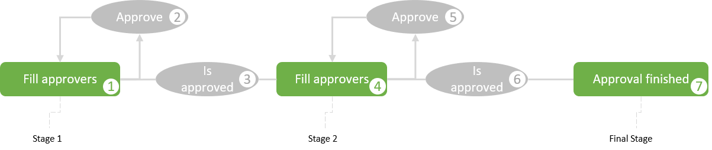
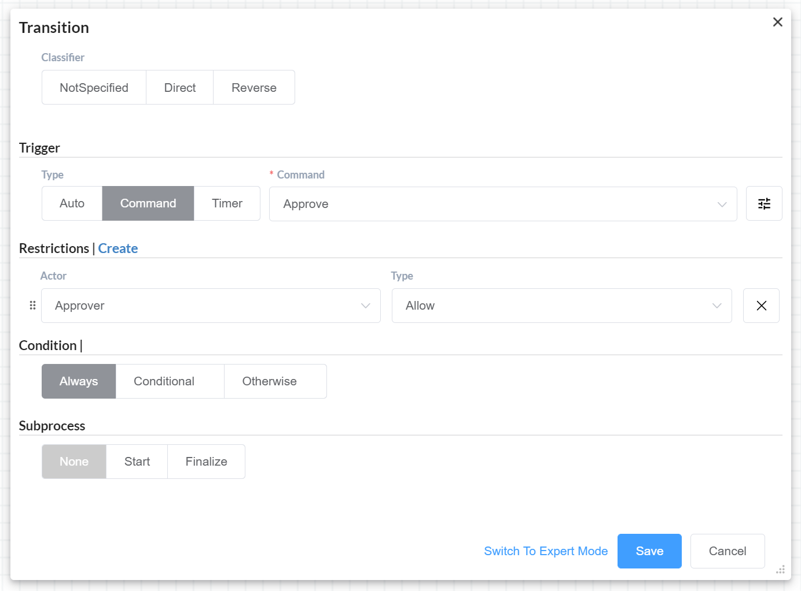

# BasicPlugin

[Плагин](/documentation/plugins/), который реализует наиболее востребованные функции для работы с процессами, параметрами и т.д.

## Сontent

1. [Installation and setting](#Installation-and-setting)
2. [Cases](#Cases)
    1. [SendEmail](#SendEmail)
    2. [HTTPRequest](#HTTPRequest)
    3. [Predefined actors](#Predefined-actors)
    4. [Update document state](#Update-document-state)
    5. [Parallel approval without branches](#Parallel-approval-without-branches)

## Installation and setting

Add the following namespaces to the usings section:
```C#
using OptimaJet.Workflow.Plugins;
```

Создайте обьект плагина и установите необходимые [Settings](#Settings):

```C#
var basicPlugin = new BasicPlugin();

// Здесь ваши настройки

// basicPlugin.Setting_Mailserver = "smtp.yourserver.com";
// basicPlugin.Setting_MailserverPort = 25;
// basicPlugin.Setting_MailserverFrom = "from@yourserver.com";
// basicPlugin.Setting_MailserverLogin = "login@yourserver.com";
// basicPlugin.Setting_MailserverPassword = "password";
// basicPlugin.Setting_MailserverSsl = true;
// basicPlugin.Setting_MailserverSsl = true;
// basicPlugin.RequestHeaders.add("MyHeader", "headerValue");
// basicPlugin.UsersInRoleAsync += MyUsersInRoleAsync;
// basicPlugin.CheckPredefinedActorAsync += CheckMyPredefinedActorAsync;
// basicPlugin.GetPredefinedIdentitiesAsync += GetMyPredefinedIdentitiesAsync;
// basicPlugin.ApproversInStageAsync += MyApproversInStageAsync;
// basicPlugin.UpdateDocumentStateAsync += UpdateMyDocumentStateAsync;
```

Подключите плагин к [WorkflowRuntime](/documentation/main-terms/runtime/):

```C#
var runtime = new WorkflowRuntime()...

runtime.WithPlugin(approvalPlugin);
```

Read about **[Settings](/documentation/plugins/basicpluginapi#Settings)**.

## Cases

### SendEmail

Для отправки сообщений используйте [action](/documentation/scheme/actions/): [SendEmail](/documentation/plugins/basicpluginapi#SendEmail).

В параметрах или настройках вам будет необходимо указать сервер и порт associated with you email address account.

Вот часть из возможных:

**Gmail:** Server: smtp.gmail.com; Port: 587

**iCloud:** Server: smtp.mail.me.com; Port: 587

**Yahoo:** Server: smtp.mail.yahoo.com; Port: 465

### HTTPRequest

Для отправки веб запроса используйте [action](/documentation/scheme/actions/): [HTTPRequest](/documentation/plugins/basicpluginapi#HTTPRequest).

### PredefinedActors

[Table of contents](#Сontent)

[Actors](/documentation/scheme/rules/#rule), которые создаются на сервере с помощью методов [WithActor](#WithActor)/[WithActors](#WithActors). Эти [actors](/documentation/scheme/rules/#rule) имеют [rule](/documentation/scheme/rules/) = [Predefined](/documentation/plugins/basicpluginapi#Predefined).

В качестве [CheckAsync](/documentation/scheme/rules/#provider) метода используется делегат [settings](#Settings) [CheckPredefinedActorAsync](#CheckPredefinedActorAsync).

В качестве [GetIdentitiesAsync](/documentation/scheme/rules/#provider) метода используется делегат [settings](#Settings) [GetPredefinedIdentitiesAsync](#GetPredefinedIdentitiesAsync).

*Для того, чтобы отобразить список преопределенных [actors](/documentation/scheme/rules/) необходимо включить соотвествующий флаг на панеле [actors](/documentation/scheme/rules/) в [designer](/documentation/main-terms/designer/).*

#### CheckPredefinedActorAsync

Делегат, ваша функция должна возвращать: ``true`` - если пользователь соотвутствует указанной [rule](/documentation/scheme/rules/); ``false`` -  если пользователь не соотвутствует указанной [rule](/documentation/scheme/rules/).

**Handler syntax:**

```C#
async Task<bool> CheckMyPredefinedActorAsync(ProcessInstance processInstance, WorkflowRuntime runtime, string parameter, string identityId)
{

  //Example: проверка что пользователь с указанными Id является менеджером
  if (parameter == "Manager")
  {
      if (identityId == myManagerId)
          return true;
      else
          return false;
  }

  return false;
}
```

#### GetPredefinedIdentitiesAsync

Делегат, ваша функция должна возвращать всех пользователей с конкретным [rule](/documentation/scheme/rules/).  С помощью этой функции вы можете реализовать как [rules](/documentation/scheme/rules/) в рамках системы безопасности, так и в рамках отдельного документа. Такие как: автор документа, менеджер документа, контроллер.

**Handler syntax:**

```C#
async Task<IEnumerable<string>> GetMyPredefinedIdentitiesAsync(ProcessInstance processInstance, WorkflowRuntime runtime, string parameter)
{
  //Example: вернуть id всех пользователей являющимися менеджерами
  if (parameter == "Manager")
  {
      return new List<string>() {myManagerId1, myManagerId2};
  }

  return new List<string>();
}
```

#### WithActor

```C#
basicPlugin.WithActor("Manager");
```

#### WithActors

```C#
basicPlugin.WithActors(new List<string>() {"Manager", "Director"});
```

### Update document state

Для обновления состояния документа в настройках используйте делегат [UpdateDocumentStateAsync](#UpdateDocumentStateAsync).

#### UpdateDocumentStateAsync

[Table of contents](#Сontent)

Делегат, который срабатывает на ProcessStatusChanged event in [WorkflowRuntime](/documentation/main-terms/runtime/).

**Handler syntax:**

```C#
public static async Task UpdateMyDocumentStateAsync(ProcessInstance processInstance, string stateName, string  localizedStateName)
{
   //here you can update document state
  myDoc.State = stateName;
}
```

### Parallel approval without branches

Реализация параллельного согласования



**1, 4: Fill approvers**

[Activity](/documentation/scheme/activities/) с [action](/documentation/scheme/actions/) из списка:

- [FillApproversUsers](/documentation/plugins/basicpluginapi#FillApproversUsers)
- [FillApproversRoles](/documentation/plugins/basicpluginapi#FillApproversRoles)

В них происходит заполнение пользователей или ролей, согласование которых необходимо на данном этапе.

**2, 5: Approve**

https://workflowengine.io/

Переходы с [Command](documentation/scheme/commands/) trigger.

Вы можете ограничить список пользователей, которым доступно выполнение команды используя механихм [Restrictions](documentation/scheme/rules/).

Добавив ограничение с параметрами Actor: Approver; Type: Allow



Read about [manage roles](documentation/faq/workflow-engine/manage-roles/)

**3, 6: Is approved**

Переходы с [condition](documentation/scheme/conditions/) из списка:

- [IsApproveComplete](/documentation/plugins/basicpluginapi#IsApproveComplete)
- [IsApprovedByUsers](/documentation/plugins/basicpluginapi#IsApprovedByUsers)
- [IsApprovedByRoles](/documentation/plugins/basicpluginapi#IsApprovedByRoles)

Переход происходит тогда, когда указанные пользователи или роли выполнили согласование.

**7: Approval finished**

[Activity](/documentation/scheme/activities/), которые выполняются после согласования.
