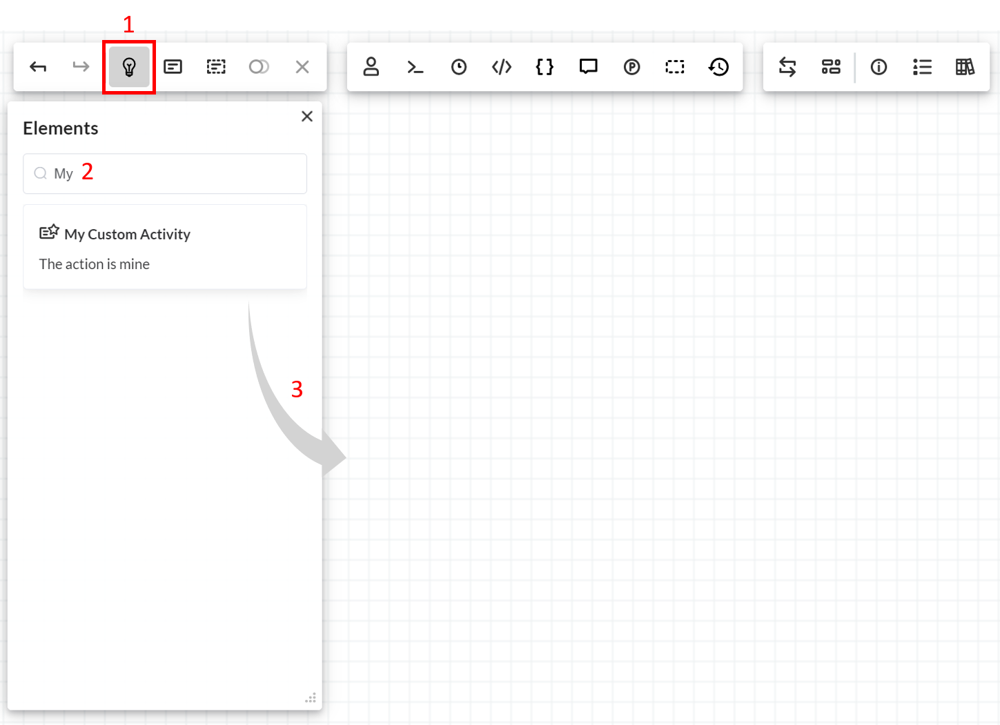

# CustomActivity

Кастомный [Activity](/documentation/scheme/activities/)

## Сontent

1. [Создание](#Создание)
2. [Custom form](#Custom-form)
3. [Custom canvas element](#Custom-canvas-element)
4. [Регистрация](#Регистрация)


### Создание

Для создания кастомных Activity нужно создать класс наследник ActivityBase.
ActivityBase в переменной Parameters хранит 2 параметра Name и State - это название Activity и статус.

Вы можете в конструкторе добавить свои переменные. Переменные аналогичны использованию параметров в IDesignerParameterFormatProvider https://workflowengine.io/documentation/designer-customization/parameter-appearance/#provider

При попадании в этот Activity WFE вызывает  метод ExecutionAsync (PreExecutionAsync для режима PreExecution).

```C#
Parameters.Add(new CodeActionParameterDefinition() { Name = "Comment", Type = ParameterType.TextArea });
```

Пример класса:

```C#
public class MyCustomActivity: ActivityBase
{
    public MyCustomActivity() : base()
    {
        Type = "MyCustomActivity";
        Title = "My Custom Activity";
        Description = "The action is mine";

        Template = "MyFormTemplate"; //название файла с вашим шаблоном формы без расширения
        SVGTemplate = "MySVGTemplate"; //название файла с вашим svg шаблоном без расширения

        Parameters.Add(new CodeActionParameterDefinition() { Name = "MyField", Type = ParameterType.TextArea });
    }

    public override async Task ExecutionAsync(WorkflowRuntime runtime, ProcessInstance processInstance, Dictionary<string, string> parameters, CancellationToken token)
    {
        Console.WriteLine("MyCustomActivity:");
        foreach(var item in parameters)
            Console.WriteLine($"{item.Key} - {item.Value}");
        Console.WriteLine("--------------");
    }

    public override async Task PreExecutionAsync(WorkflowRuntime runtime, ProcessInstance processInstance, Dictionary<string, string> parameters, CancellationToken token)
    {
     
    }
}
```

### Custom form

Для изменения формы Activity вам нужно в папке templates создать новый файл с расширением .html и указать его название в поле Template.

*В качестве примера вы можете скопировать файл activity.html*

### Custom canvas element

Для изменения отображения Activity на канвасе вам нужно в папке templates\elements создать новый файл с расширением .svg и указать его название в поле SVGTemplate.

*В качестве примера вы можете скопировать файл activity.svg*

### Регистрация

Для регистрации нужно вызвать метод WithCustomActivities у объекта WorkflowRuntime:

```C#
_runtime.WithCustomActivities(new ActivityBase[] { new MyCustomActivity() })
```

Все кастомные Activities будут отображаться в панели **Elements**:



Чтобы добавить ваш кастомный активити в схему необходимо:
1. Открыть панель Elements
2. Найти активити в списке элементов или использовать поиск
3. Перетащить элемент на канвас