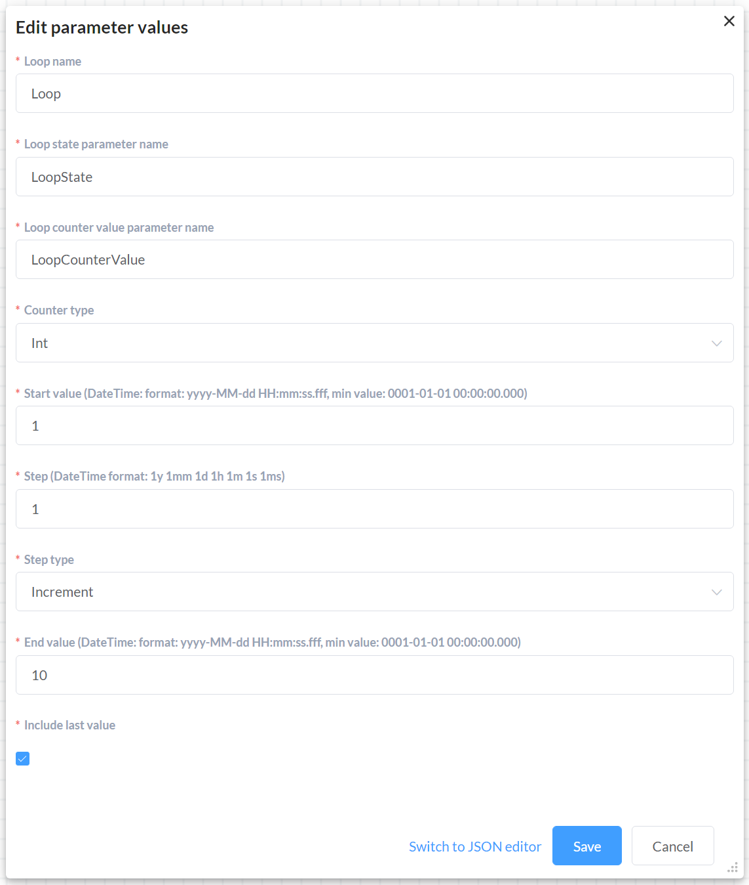
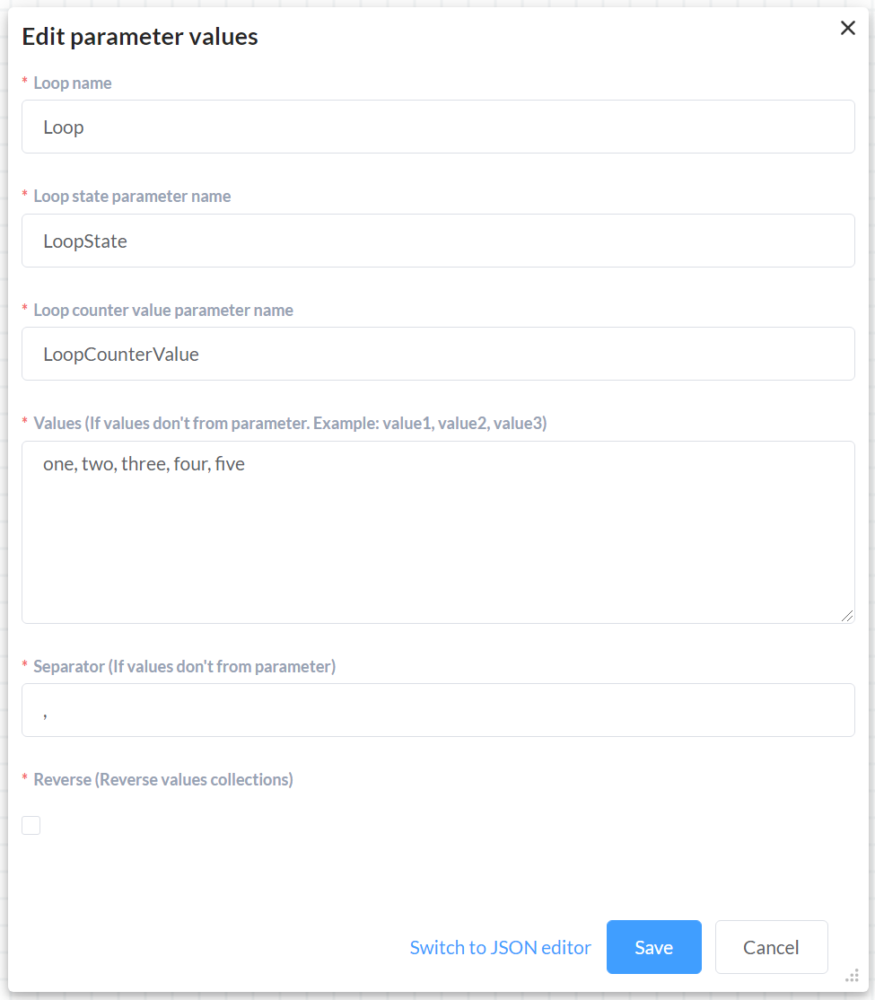
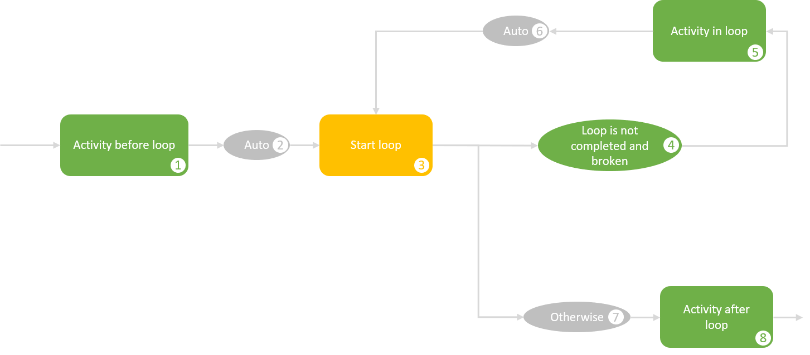
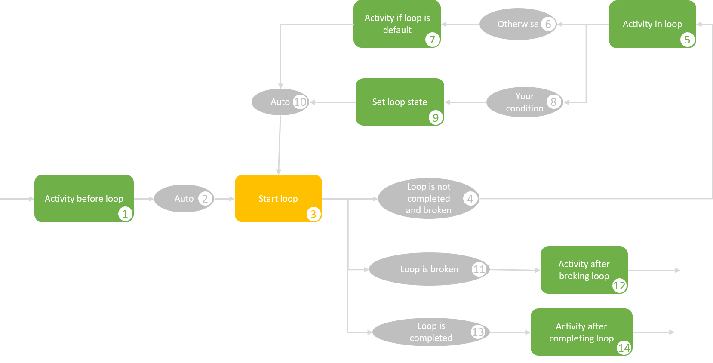

# LoopsPlugin

[Плагин](/documentation/plugins/), который реализует функции для организации циклов в вашей схеме.

## Сontent
1. [Terms](#Terms)
    1. [Loop](#Loop)
    2. [Initialization](#Initialization)
    3. [LoopStates](#LoopStates)
    4. [LoopCounter](#LoopCounter)
    5. [CounterType](#CounterType)
    6. [StepType](#StepType)
2. [Installation and setting](#Installation-and-setting)  
3. [Cases](#Cases)
    1. [Простой цикл](#Простой-цикл)
    2. [Цикл с использованием break and continue](#Цикл-с-использованием-break-and-continue)

## Terms

### Loop

Позволяет повторно выполнять части вашей схемы определенное количество раз согласно описанной логики.

**Цикл for**: выполняет тело цикла (кусок схемы согласно описанной логике) пока определенное логическое выражение равно значению true.

**Цикл foreach**: перебирет элементы списка и для каждого элемента выполняет тело цикла (кусок схемы согласно описанной логике).

В целом оба типа циклов работают одинаково и имеют основное отличие только в инициализации.

### Initialization

#### Loop for initialization example:



В этом примере создается цикл For с именем "Loop".

На каждой итерации цикла начальное значение (Start value: 1) будет увеличиваться (Step type: Increment) на указанное значение (Step: 1) до тех пора полученное значение не будет меньше конечного значения (End value: 10).

Данный цикл будет выполнен 10 раз.

Счетчик будет принимать значения: 1, 2, 3, 4, 5, 6, 7, 8, 9, 10.

Текущее значение счетчика может быть получено из переменной "LoopCounterValue".

Текущее состояние цикла может быть получено из переменной "LoopState".

#### Loop foreach initialization example



В этом примере создается цикл Foreach с именем "Loop".

На каждой итерации цикла будет взят следующий элемент из списка значений (Values: one, two, three, four, five).
Данный цикл будет выполнен 5 раз.

Счетчик будет принимать значения: one, two, three, four, five.

Текущее значение счетчика может быть получено из переменной "LoopCounterValue".

Текущее состояние цикла может быть получено из переменной "LoopState".

#### Важно: 

- Каждый цикл должен иметь уникальное имя.
- Использование не укникальных имен приведет к перетиранию результатов цикла с тем же именем записанным ранее.
- Использование одинаковых имен для вложенных циклов приведет к непредсказуемым сбоям в работе. 

### LoopStates

[Table of contents](#Сontent)

|Значение| Описание |
|----------------|----------------|
|Default | Итерация может быть продолжена|
|Complete | Цикл выполнен|
|Continue | Вызван оператор [Continue](https://docs.microsoft.com/en-us/dotnet/csharp/language-reference/keywords/continue)|
|Break | Вызван оператор [Break](https://docs.microsoft.com/en-us/dotnet/csharp/language-reference/keywords/break)|

Для вызова оператора Break или Continue вы можете использовать специальные расширения ProcessInstance, например:

```C#
using OptimaJet.Workflow.Core.Plugins;

//Эквивалентно вызову оператора Continue
await processInstance.LoopContinueAsync("LoopName").ConfigureAwait(false);

//Эквивалентно вызову оператора Break
await processInstance.LoopBreakAsync("LoopName").ConfigureAwait(false);
```

Или

```C#
using OptimaJet.Workflow.Core.Plugins;

//Получить текущее состояние цикла
LoopState loopState = await processInstance.GetLoopStateAsync("LoopName").ConfigureAwait(false);

//Установить состояние цикла
await processInstance.SetLoopStateAsync("LoopName", LoopState.Break).ConfigureAwait(false);
```

*Или через имя [parameter](/documentation/scheme/parameters/) имя которого вы указали на форме.*

### LoopCounter

[Table of contents](#Сontent)

Объект класса, описывающий счетчик цикла

**Поля:**

```C#
public class LoopCounter
{
    public int Index { get; set; } //Номер текущей итерации
    public object Value { get; set; } //Текущее значение счетчика
}
```

Для того, чтобы получить текущее/следующее/предыдущее значение счетчика вы можете использовать расширения ProcessInstance, например:

```C#
using OptimaJet.Workflow.Core.Plugins;

//Получить текущее значение счетчика
LoopCounter currentLoopCounter = await processInstance.GetLoopCurrentCounterValueAsync("LoopName").ConfigureAwait(false);

//Получить предыдущее значение счетчика
LoopCounter prevLoopCounter = await processInstance.GetLoopPrevCounterValueAsync("LoopName").ConfigureAwait(false);

//Получить предыдущее значение счетчика
LoopCounter nextLoopCounter = await processInstance.GetLoopNextCounterValueAsync("LoopName").ConfigureAwait(false);
```

*Или через [parameter](/documentation/scheme/parameters/) имя которого вы указали на форме.*

### CounterType
[Table of contents](#Сontent)

|Значение| Описание |
|----------------|----------------|
|Int | Цикл по целым числам|
|DateTime | Цикл по датам|

### StepType
[Table of contents](#Сontent)

|Значение| Описание |
|----------------|----------------|
|Increment | Каждую итерацию шаг будет прибавляться к текущему значению|
|Decrement | Каждую итерацию шаг будет вычитаться из текущего значения|


## Installation and setting

Add the following namespaces to the usings section:

```C#
using OptimaJet.Workflow.Plugins;
```

Создайте обьект плагина:

```C#
var loopPlugin = new LoopPlugin();
```

Подключите плагин к [WorkflowRuntime](/documentation/main-terms/runtime/):

```C#
var runtime = new WorkflowRuntime()...

runtime.WithPlugin(loopPlugin);
```

## Cases

### Простой цикл



**1: Activity before loop**

[Activity](/documentation/scheme/activities/) выполняемые до цикла.

**2, 6: Auto**

Переход с [condition](documentation/scheme/conditions/): [Auto](/documentation/scheme/transitions/).

**3: StartLoop**

[Activity](/documentation/scheme/activities/) с [action](/documentation/scheme/actions/) из списка:

- [StartLoopFor](/documentation/plugins/loopspluginapi#StartLoopFor)
- [StartLoopForeach](/documentation/plugins/loopspluginapi#StartLoopForeach)
- [StartLoopForeachFromParameter](/documentation/plugins/loopspluginapi#StartLoopForeachFromParameter)

При первом заходе в активити происходит инициализация цикла.
При повторном заходе происходит обновление счетчика цикла.

*При повторном после завершения цикла заходе - цикл начинается сначала.*

**4: Loop is not completed and broken**

Переход с [condition](documentation/scheme/conditions/): [LoopIsNotCompletedAndBroken](/documentation/plugins/loopspluginapi#LoopIsNotCompletedAndBroken)

Переход происходит если цикл не был выполнен или прерван.

**5: Activity in loop**

[Activity](/documentation/scheme/activities/), которые выполняются в каждой итерации цикла.

**7: Otherwise**

Переход с [condition](documentation/scheme/conditions/): [Otherwise](/documentation/scheme/transitions/)

Переход происходит если цикл завершил работу(был выполнен или прерван).

**8: Activity after loop**

[Activity](/documentation/scheme/activities/), которые выполняются после завершения работы цикла.

### Цикл с использованием break and continue



**1: Activity before loop**

[Activity](/documentation/scheme/activities/) выполняемые до цикла.

**2, 10: Auto**

Переход с [condition](documentation/scheme/conditions/): [Auto](/documentation/scheme/transitions/).

**3: StartLoop**

[Activity](/documentation/scheme/activities/) с [action](/documentation/scheme/actions/) из списка:

- [StartLoopFor](/documentation/plugins/loopspluginapi#StartLoopFor)
- [StartLoopForeach](/documentation/plugins/loopspluginapi#StartLoopForeach)
- [StartLoopForeachFromParameter](/documentation/plugins/loopspluginapi#StartLoopForeachFromParameter)

При первом заходе в активити происходит инициализация цикла.
При повторном заходе происходит обновление счетчика цикла.

*При повторном после завершения цикла заходе - цикл начинается сначала.*

**4: Loop is not completed and broken**

Переход с [condition](documentation/scheme/conditions/): [LoopIsNotCompletedAndBroken](/documentation/plugins/loopspluginapi#LoopIsNotCompletedAndBroken)

Переход происходит если цикл не был выполнен или прерван.

**5: Activity in loop**

[Activity](/documentation/scheme/activities/), которые выполняются в каждой итерации цикла.

**6: Otherwise**

Переход с [condition](documentation/scheme/conditions/): [Otherwise](/documentation/scheme/transitions/)

Переход происходит если цикл завершил работу (был выполнен или прерван).

**7: Your condition**

Переход [conditions](documentation/scheme/conditions/) при котором цикл необходимо прервать или пропустить итерацию.

**8: Activity if loop is default**

[Activity](/documentation/scheme/activities/), которые выполняются, если условия указанные в **Your condition** не выполняются.

**9: Set loop state**

[Activity](/documentation/scheme/activities/) с [action](/documentation/scheme/actions/): [SetLoopState](documentation/plugins/loopspluginapi#SetLoopState)

В котором вы выполняете для цикла [Continue](https://docs.microsoft.com/en-us/dotnet/csharp/language-reference/keywords/continue) или [Break](https://docs.microsoft.com/en-us/dotnet/csharp/language-reference/keywords/break).

**11: Loop is broken**

Переход с [condition](documentation/scheme/conditions/): [LoopIsBroken](/documentation/plugins/loopspluginapi#LoopIsBroken)

Переход происходит если цикл не был выполнен или прерван.

**12: Activity after broking loop**

[Activity](/documentation/scheme/activities/), которые выполняются после *прерывания*  работы цикла.

**13: Loop is completed**

Переход с [condition](documentation/scheme/conditions/): [LoopIsCompleted](/documentation/plugins/loopspluginapi#LoopIsCompleted)

Переход происходит если цикл не был выполнен или прерван.

**14: Activity after completing loop**

[Activity](/documentation/scheme/activities/), которые выполняются после *успешного* завершения работы цикла.
